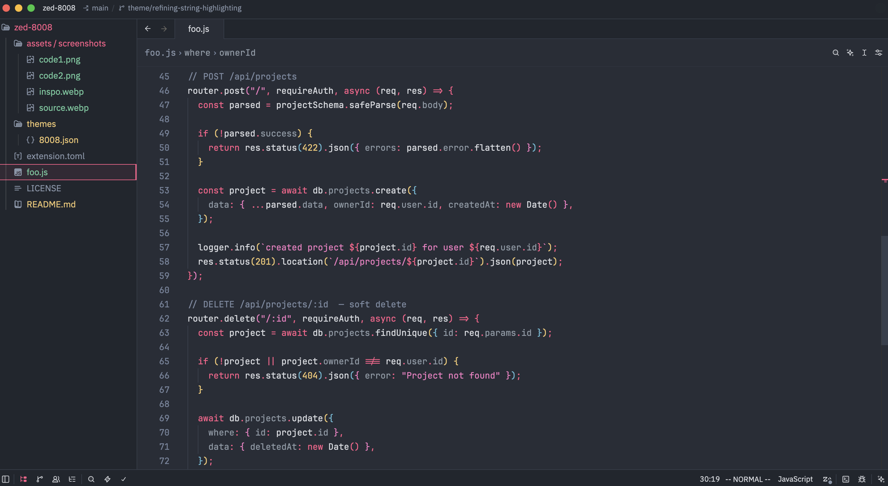
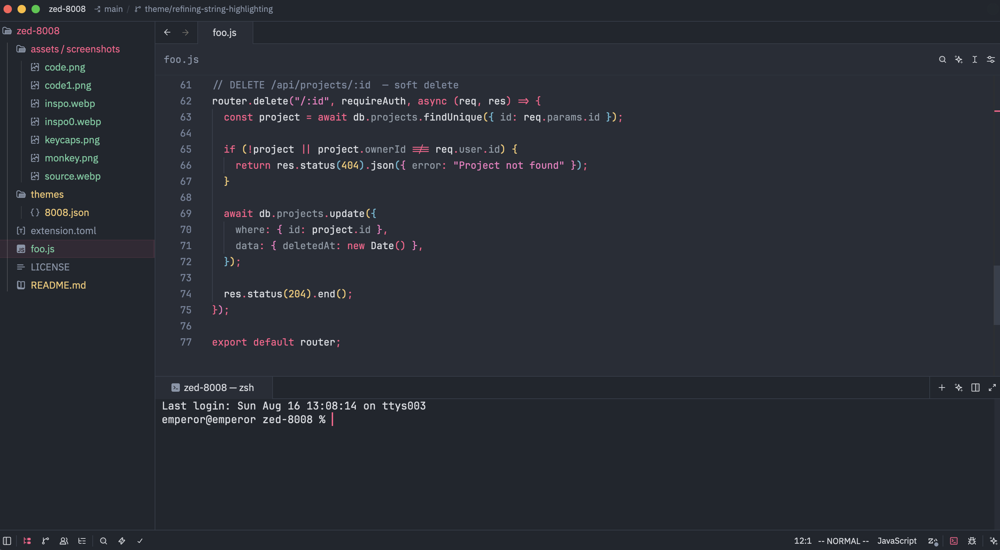
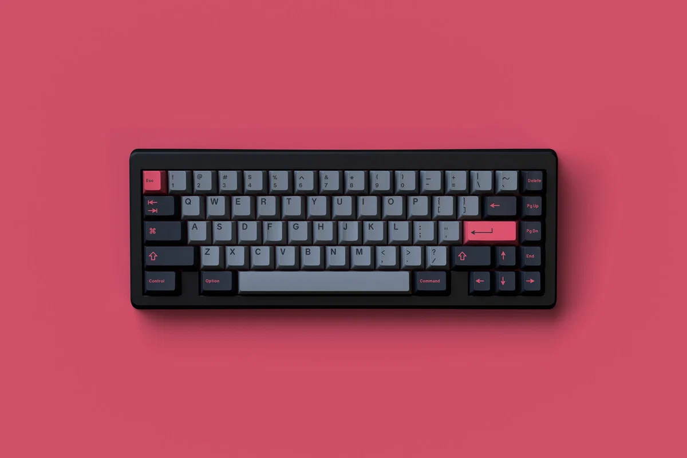

# Zed 8008

A theme for Zed inspired by the GMK 8008 keycap set.

## Screenshots

8008 Dark

**Enjoy!**

## [Inspo](https://prototypist.net/products/in-stock-gmk-cyl-8008-r2-keycap-set)

## Credits

The theme was inspired by the **GMK 8008** keycap set, originally run as a group
buy by [Omnitype(previous known as Dixie Mech)](https://dixiemech.store) in 2019, with later groupbuy rounds through
[Omnitype](https://omnitype.com/products/gmk-8008-2-keycap-set) and
[Prototypist](https://prototypist.net/products/in-stock-gmk-cyl-8008-r2-keycap-set).

This theme is an independent, non-commercial fan made project. It is not affiliated
with, endorsed by, or sponsored by GMK Electronic Design GmbH, Dixie Mech, or
Omnitype. "GMK" and all product names are the property of their respective
owners.

## License

The [MIT license](./LICENSE) applies to the theme files in this repository. Any
referenced trademarks and third-party photographs are the property of their
owners and are not covered by it.
